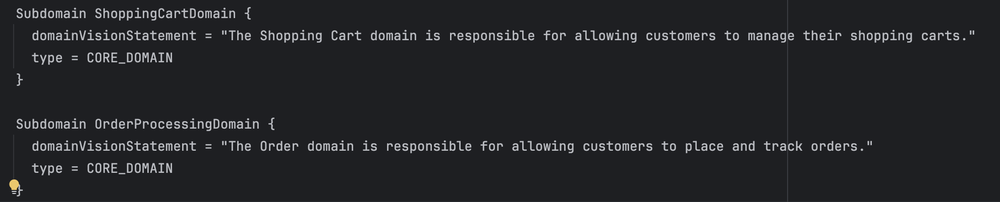

# Réponses TD1

## Questions

### Quels sont les principaux domaines métiers de l'application Order flow ?

Les deux principaux domaines métiers de l'application Order flow sont 


- ShoppingCartDomain : Panier d'achat
- OrderProcessingDomain : Traitement des commandes


### Pourquoi les microservices sont-ils conçus pour implémenter les domaines métiers ?

Les microservices sont conçus pour implémenter les domaines métiers pour permettre 
une scalabilité de l'application. Séparer les services permet de gérer plus facilement la charge de l'application.

Certains microservices sont découpés en 


### Quelles sont les responsabilités des conteneurs de code apps/of-api-gateway, apps/of-product-registry-microservices/product.registry, apps/of-product-registry-microservices/product.registry.read, libs/event-sourcing, libs/published-language ?

- `apps/of-api-gateway` : Conteneur de code qui gère les requêtes HTTP et les redirige vers les microservices appropriés.
- `apps/of-product-registry-microservices/product.registry` : Conteneur de code qui gère les produits.
- `apps/of-product-registry-microservices/product.registry.read` : Conteneur de code qui gère la lecture des produits.

EDA (Event Driven Architecture) :
- `libs/event-sourcing` : Conteneur qui enregistre les états des événements pour les stocker dans une base de données. (Permet de gérer les événements, faire des rollback, meilleure traçabilité des produits)
- `libs/published-language` : Conteneur de code qui gère et implémente le contexte métier de l'application.


## Tâche 2 : Identifier les concepts principaux

L'application Order flow utilise des modèles spécifiques pour implémenter les domaines métiers. Ces modèles sont basés sur les principes de la conception pilotée par le domaine (DDD) et de l'architecture pilotée par les événements (EDA).

Vous devez identifier les concepts principaux utilisés dans l'application Order flow.

## Réponses aux questions

### Quels sont les concepts principaux de l'application Order flow ?

Les concepts principaux de l'application Order flow sont les suivants :
- Séparation des domaines métiers en microservices
- Architecture pilotée par les événements (EDA)
- Conception pilotée par le domaine (DDD)
- Gestion des événements
- Persistance des événements
- La matérialisation des métiers

### Comment les concepts principaux sont-ils implémentés dans les microservices ?


### Que fait la bibliothèque libs/event-sourcing ? Comment est-elle utilisée dans les microservices (relation entre métier et structure du code) ?


- Pulsar 
- Quarkus
- Event Sourcing
- MongoDB pour la persistance 
- Gradle pour la gestion des dépendances


## SonarLint

### Quels sont les problèmes détectés par SonarLint dans le code source de l'application Order flow ?

SonarLint détecte les problèmes suivants dans le code source de l'application Order flow :

#### `Event.java`

La classe `Event.java` contient une classe abstraite avec un constructeur public qui devrait être en `protected`.

Suggestion de correction :
```java
protected Event(
      EventId id,
      String aggregateId,
      long version,
      long timestamp,
      String eventType) {
    this.id = id;
    this.aggregateId = aggregateId;
    this.version = version;
    this.timestamp = timestamp;
    this.eventType = getEventType();
  }
```

#### `GetProducts.java`

La classe `GetProducts.java` contient une méthode `GetProducts` qui est le constructeur qui n'est pas implémentée.
Elle est vide et il faut soit lui faire retourner une exception, soit l'implémenter ou bien la supprimer car le compilateur crée un constructeur par défaut.


#### `ProductIdTest.java`

Les méthodes de test dans ce fichier ne suivent pas la convention de nommage des méthodes de test.

Exemple : 

```java
    public void it_should_returnDifferentHashCode_when_comparingIdsOfDifferentValues(){
        ProductId productId1 = new ProductId("1");
        ProductId productId2 = new ProductId("2");
        assertNotEquals(productId1.hashCode(), productId2.hashCode());
    }
```

Il faudrait renommer les test nommées ainsi en 
`ìtShouldReturnDifferentHashCodeWhenComparingIdsOfDifferentValues` même si le `it` n'est pas nécessaire.


#### `ProductQueryResultConsumer.java`

La classe contient une méthode 

- Manque de la java doc sur certaines méthodes et classe
- Utilisation de Record plus adaptée pour les DTO dans `api-gateway`
- On évite de lancer trop d'exceptions car on perd en performance

####  `ProductRemovedEventEntity.java`

On devrait plutôt utiliser des `Record` ici aussi car on peut les rendre immuables et éviter les problèmes de concurrence.


#### `ProductRegistryEventEntity.java`

SonarLint détecte un problème mais non car il représente une classe spécifique car représente une entité de la base de données.
Donc on a le droit de mettre les attributs en public.


#### `ProductRegistryService` et `ProductRegistryCommandConsumer.java`

Il faudrait avoir une meilleure gestion des erreurs 

En cas de problème d'erreur métier on devrait nack le message et le remettre dans la queue pour le traiter plus tard mais le limité à un certain nombre de fois pour éviter les boucles infinies.


On évite de mutualiser les exceptions
peu importe le type d'exception (technique ou métier) on doit permettre au erreurs métiers de remonter jusqu'à l'utilisateur et ne pas les rejouer en boucle alors que les erreurs techniques doivent facilement pouvoir être rejouer plusieurs fois pour éviter les pertes de données.

Il faut donc séparer les processus en fonction du type d'erreur pour améliorer cette gestion des erreurs.

Le paradigme asynchrone considère que ce que l'utilisateur demande doit être traitée.


